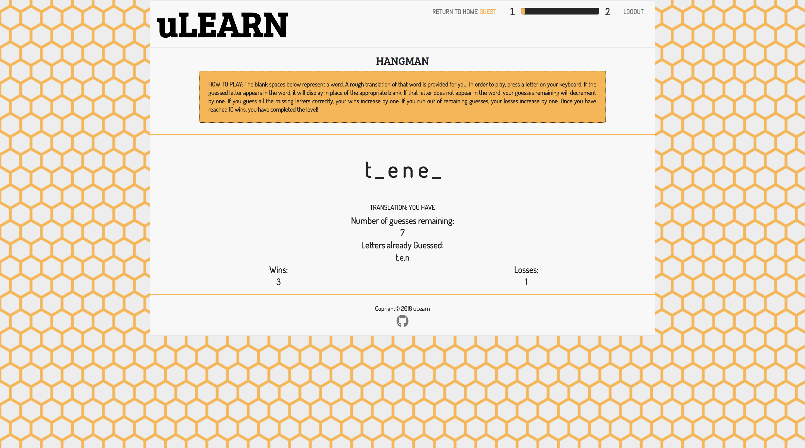
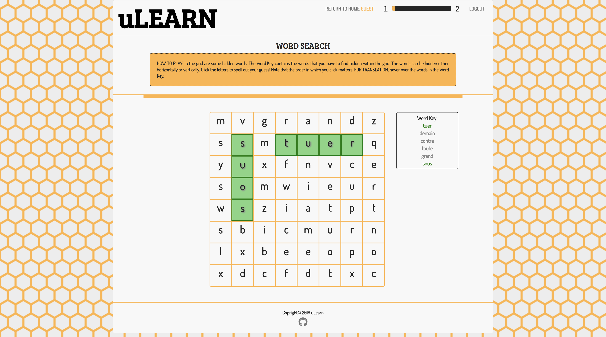

# Language-Learner

<https://github.com/kmatchu/Language-Learner> \
Version 1.0 \
Original Deployment Date - March 21, 2018

# The Idea:

The idea behind this application is to provide users with a fun an easy way to learn a new language by playing games!

# Users Guide:

Application Link - <https://language-learner2018.herokuapp.com/>

Instructions -

Landing Page:

When a user arrives on our page, they will see this Landing Page. They can learn a little bit more about our website, and when they are ready they can choose to sign up for an account, log in to their existing account, or continute to learn as a guest. They will then be directed to our Home Page.

Home Page:

Here the user selects which language they would like to learn, which game they would like to play, and which difficulty level they want to attempt. Once they have made their selections, and press the Play button, they will be directed to the appropriate Game Page.

Jumble Game Page:

You're given some scrambled words below. Your goal is to unscramble them. Type your
unscrambled guess and move onto the next word and the game will automatically check whether
your guess is correct or not. If you guessed correctly, your guess will turn green. If it's
wrong, it will turn red. PRESS TAB to easily move between the guess boxes. Happy Guessing!

Hangman Game Page:

The blank spaces represent a word. A rough translation of that word is provided
for you. In order to play, press a letter on your keyboard. If the guessed letter appears
in the word, it will display in place of the appropriate blank. If that letter does not appear
in the word, your guesses remaining will decrement by one. If you guess all the missing letters
correctly, your wins increase by one. If you run out of remaining guesses, your losses increase
by one. Once you have reached 10 wins, you have completed the level!

WordSearch Game Page:

In the grid are some hidden words. The Word Key contains the words that you have to find hidden within the grid. The words can be hidden either horizontally or vertically. Click the letters to spell out your guess! Note that the order in which you click matters. For translation, hover over the words in the Word Key.

# Built Utilizing:

jQuery - <http://api.jquery.com/> \
Bootstrap v3 - <http://getbootstrap.com/docs/3.3/> \
Yandex API - <https://developer.spotify.com/web-api/> \
FrequencyWords - <https://github.com/hermitdave/FrequencyWords> \
Anime.Js - <http://animejs.com/documentation/> \

# Original Contributors:

Kevin Mathew - <https://github.com/kmatchu> \
Codi Steinborn  - <https://github.com/codisteinborn/> \
Natraj Subramanian- <https://github.com/natraj-s>
